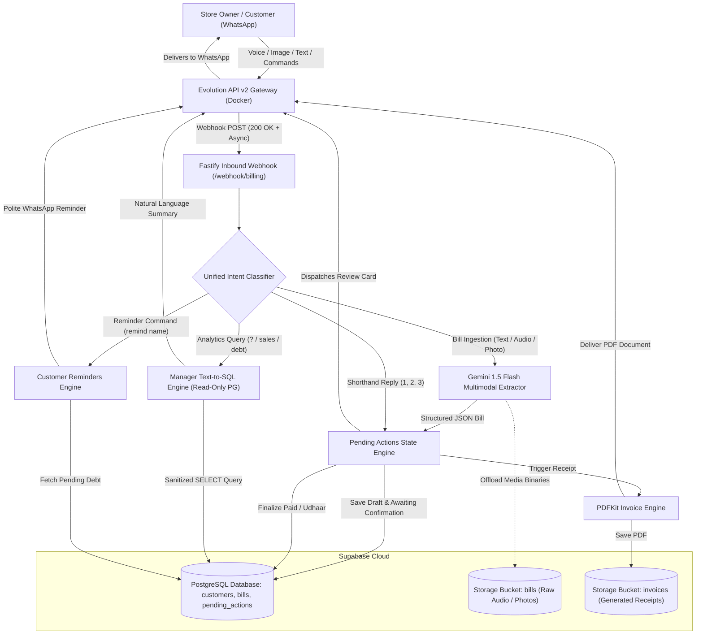

# AI-First WhatsApp Billing & CRM Agent for Kirana & Retail

[](https://www.typescriptlang.org/)
[](https://fastify.dev/)
[](https://supabase.com/)
[](https://ai.google.dev/)
[](https://www.docker.com/)

A self-hosted, multimodal WhatsApp billing platform that turns unstructured Kirana store receipts, voice notes, and vernacular texts into structured accounting, automated PDF invoices, and real-time customer debt tracking.

---

## Architecture

### Overview
The agent is built on an event-driven, decoupled micro-architecture designed specifically for conversational retail environments:

- **Event-Driven Webhook Ingestion**: Receives inbound WhatsApp events from an Evolution API v2 gateway via Fastify HTTP endpoints, acknowledging immediately with `200 OK` in <10ms to eliminate Baileys retry loops.
- **Single-Chat Unified Intent Routing**: Operates within a single store owner WhatsApp chat, using regex and linguistic heuristics to route between bill drafting, numeric confirmation shorthand (`1`, `2`, `3`), payment reminders, and Text-to-SQL analytics without conversational collisions.
- **Asynchronous Background Offload**: Offloads Gemini 1.5 Flash multimodal parsing, PDFKit invoice generation, and customer WhatsApp messaging to asynchronous background tasks for real-time responsiveness.
- **Dual-Storage Persistence**: Combines Supabase Storage buckets (`bills` for incoming voice/image binaries and `invoices` for generated PDF receipts) with a PostgreSQL relational database for strict transactional consistency and atomic state transitions.



---

## Key Features

### 1. Multimodal Ingestion
- **Voice Note Billing**: Accepts WhatsApp audio messages (`.ogg` / `.opus`), stores raw audio in Supabase Storage, and natively transcribes item quantities, prices, and customer details using Gemini 1.5 Flash.
- **Paper Receipt OCR**: Parses images of handwritten register chits or printed thermal receipts with zero manual data entry.
- **Text Stream**: Ingests shorthand conversational messages like `"Ramesh 9876543210 2 sugar 90, 1 oil 160 paid"`.

### 2. Vernacular Debt Semantics
- Automatically detects settlement versus credit status across English, Hindi, and Telugu:
  - **Settled / Cash**: `paid`, `cash`, `gpay`, `phonepe`, `received`, `settled`, `jama`, `diya`, `ichadu`.
  - **Credit / Udhaar**: `udhaar`, `baki`, `baaki`, `credit`, `pending`, `katha`, `khata`, `ivvali`, `lena hai`.

### 3. 3-Tier Customer CRM
- **Tier 1: Existing Customer**: Matched by phone number or name (`ILIKE`). The confirmation card dynamically surfaces their outstanding balance:
  ```text
  Customer: Ramesh (Existing — Outstanding Udhaar: Rs. 1,450)
  ```
- **Tier 2: New Customer Onboarded**: Registered automatically when a name or phone is seen for the first time, starting with `0` initial debt.
- **Tier 3: Walk-in Customer (Anonymous)**: Assigned when no identifiers are present.
- **Walk-in Credit Prevention**: Anonymous walk-in bills cannot be confirmed as Udhaar (`2`). The system alerts the store owner and holds the draft until customer identification is provided.

### 4. Atomic State Engine
- **Single Active Draft**: Exactly one draft is active per store owner at any time. Ingesting a new bill automatically marks any pending unconfirmed draft as `superseded`.
- **Deterministic Shorthand**: Review drafts are confirmed using numeric shorthand:
  - `1` (or `paid`, `settled`) ➔ Confirm Paid
  - `2` (or `udhaar`, `pending`) ➔ Confirm Udhaar
  - `3` (or `cancel`, `discard`) ➔ Discard Draft
- **60-Second Finalization Window**: If an owner replies shorthand after confirmation, the system checks `resolved_at`. If resolved within 60 seconds, it alerts:
  ```text
  ⚠️ This bill has already been confirmed and finalized.
  ```
- **Quantity-Prefix Preservation**: Eliminates numeric prefix ambiguity so messages like `"2 cold drinks 80"` extract as line items rather than triggering shorthand confirmation `2`.

### 5. Invoicing & Reminders
- **Branded PDF Generation**: Uses PDFKit to produce clean tax invoices with store branding, itemized tables, totals, and colored status badges (`PAID` in green, `PENDING UDHAAR` in amber).
- **Zero Owner Document Spam**: The store owner receives only a text confirmation card; PDF documents are not spammed to the owner's chat.
- **Direct Customer Delivery**: Delivered directly to the customer's WhatsApp if a valid 10+ digit phone exists. For placeholder numbers (`newcust-`, `walkin-`), the PDF URL is silently stored in `bills.pdf_url`.
- **Vernacular Payment Reminders**: The owner can trigger payment reminders via `"remind <name>"` to query outstanding balances and dispatch polite reminders in the customer's preferred language.

### 6. Text-to-SQL Analytics
- **Conversational Business Intelligence**: Store owners can ask natural language business questions directly in WhatsApp (e.g., `"? Who owes more than 500 rupees?"`, `"Total sales today?"`, `"Aaj ka hisaab?"`).
- **Strict Read-Only Guardrails**:
  - Enforces `SELECT`-only execution; all mutating statements (`INSERT`, `UPDATE`, `DELETE`, `DROP`, `ALTER`, `TRUNCATE`) and multi-statement semicolons (`;`) are blocked.
  - Access to PostgreSQL system tables (`pg_*`, `information_schema`) is restricted.
  - Executed on a dedicated PostgreSQL read-only transaction with a strict 3000ms timeout and a 50-row output clamp.

---

## Quickstart & Testing Guide

### Prerequisites
- **Node.js**: v20.x or higher
- **Docker & Docker Compose**: For running Evolution API v2 gateway
- **Supabase Project**: PostgreSQL database and Storage buckets (`bills`, `invoices`)
- **Google Gemini API Key**: For multimodal bill extraction and SQL translation
- **Active WhatsApp Number**: Connected to the Evolution API instance

---

### Local Setup

1. **Clone the repository:**
   ```bash
   git clone https://github.com/goutham2222/ai-billing-agent.git
   cd ai-billing-agent
   ```

2. **Install dependencies:**
   ```bash
   npm install
   ```

3. **Configure Environment Variables:**
   Copy `.env.example` to `.env` and fill in the required keys:
   ```bash
   cp .env.example .env
   ```
   Key environment variables:
   - `GEMINI_API_KEY`: Google Gemini API key
   - `SUPABASE_URL` & `SUPABASE_SERVICE_ROLE_KEY`: Supabase credentials
   - `DATABASE_URL`: PostgreSQL connection string
   - `EVOLUTION_API_URL` & `EVOLUTION_API_KEY`: Evolution API URL and API key
   - `EVOLUTION_INSTANCE_NAME`: Name of your WhatsApp instance
   - `STORE_OWNER_PHONE`: Normalized E.164 phone number of store owner (e.g. `919550145675`)

4. **Launch Evolution API (Docker):**
   ```bash
   docker compose -f infra/docker-compose.yml up -d
   ```
   Open `http://localhost:8080`, scan the QR code to connect WhatsApp, and configure the webhook to `https://your-domain/webhook/billing`.

5. **Start Development Server:**
   ```bash
   npm run dev
   ```

---

### Test Drive Cheat Sheet

Send these messages from your authorized `STORE_OWNER_PHONE` to test the full lifecycle:

| Action / Test Case | WhatsApp Message | Expected Behavior |
| :--- | :--- | :--- |
| **New Customer Bill** | `Ramesh 9876543210 2 kg sugar 90, 1 sunflower oil 160 paid` | Draft created, Ramesh registered as new customer, confirmation card dispatched (Total: Rs. 250). |
| **Vernacular Udhaar Bill** | `Suresh 9123456789 5 bread 200 udhaar` | Extracts items and flags `udhaar` credit status, creating a review draft for Rs. 200. |
| **Confirm Paid** | `1` or `paid` | Confirms draft as PAID, updates customer ledger, delivers PDF to customer WhatsApp, sends text receipt to owner. |
| **Confirm Udhaar** | `2` or `udhaar` | Confirms draft as PENDING UDHAAR, updates outstanding debt balance on customer record, delivers PDF. |
| **Discard Draft** | `3` or `cancel` | Cancels the active draft and confirms cancellation to the owner. |
| **Walk-in Credit Guardrail** | Send: `2 cold drinks 80`<br>Then reply: `2` | Udhaar blocked: *"⚠️ Cannot assign Udhaar to an anonymous Walk-in Customer. Please provide customer name or phone."* Draft remains active. |
| **Manager Analytics (English)** | `? Who owes more than 500 rupees?` | Translates to `SELECT`, queries ledger, and returns customer debt breakdown. |
| **Manager Analytics (Vernacular)**| `Aaj ka total sales kitna hai?` | Translates to `SELECT SUM(total_amount)`, returns today's sales figure. |
| **Customer Payment Reminder** | `remind Suresh` | Queries Suresh's pending debt and sends a polite reminder directly to his WhatsApp. |
| **Clean Database Utility** | Terminal: `npm run db:clean` | Truncates `pending_actions`, `bills`, `customers`, resets bill sequence to 1, and clears storage buckets. |

---

## Database Schema

Summary of primary Supabase PostgreSQL tables:

```sql
-- 1. Customers Table (Patron Ledger)
CREATE TABLE customers (
    id UUID PRIMARY KEY DEFAULT gen_random_uuid(),
    name TEXT NOT NULL,
    phone TEXT UNIQUE NOT NULL,
    preferred_language TEXT DEFAULT 'en', -- 'en', 'hi', 'te'
    created_at TIMESTAMPTZ DEFAULT NOW()
);

-- 2. Bills Table (Transaction History)
CREATE TABLE bills (
    id UUID PRIMARY KEY DEFAULT gen_random_uuid(),
    bill_no SERIAL, -- Auto-incrementing human-readable bill number
    customer_id UUID REFERENCES customers(id) ON DELETE SET NULL,
    total_amount NUMERIC(12, 2) NOT NULL,
    items JSONB DEFAULT '[]', -- [{"name": "Sugar", "quantity": 2, "unit": "kg", "unitPrice": 45, "totalPrice": 90}]
    image_url TEXT,
    pdf_url TEXT,
    payment_status TEXT CHECK (payment_status IN ('paid', 'pending', 'cancelled')) DEFAULT 'pending',
    created_at TIMESTAMPTZ DEFAULT NOW()
);

-- 3. Pending Actions Table (State Machine)
CREATE TABLE pending_actions (
    whatsapp_message_id TEXT PRIMARY KEY,
    bill_data JSONB, -- Draft payload snapshot (items, customer tier, debt)
    owner_phone TEXT,
    status TEXT DEFAULT 'awaiting_confirmation', -- 'awaiting_confirmation', 'completed', 'cancelled', 'superseded'
    created_at TIMESTAMPTZ DEFAULT NOW()
);
```

---

## Project Structure

```text
src/
├── config/
│   └── env.ts                     # Zod environment variable schema & validation
├── lib/
│   ├── db-readonly.ts             # Read-only PostgreSQL pool with safety timeouts
│   ├── evolution.ts               # Evolution API v2 WhatsApp client (text, media, polls)
│   ├── gemini.ts                  # Gemini 1.5 Flash client with fallbacks & backoff
│   └── supabase.ts                # Supabase admin client (Service Role)
├── modules/
│   ├── billing/                   # Multimodal ingestion, extraction & confirmation
│   │   ├── bridge.ts              # Media binary offloader to Supabase Storage
│   │   ├── extractor.ts           # Multimodal Gemini bill parser (text, audio, image)
│   │   ├── routes.ts              # Webhook receiver & confirmation shorthand handler
│   │   ├── schemas.ts             # Zod validation schemas for bill line items & customer data
│   │   └── state.ts               # Atomic draft state machine & 3-tier customer CRM
│   ├── invoicing/                 # Receipts & customer payment reminders
│   │   ├── pdf-generator.ts       # Branded PDFKit tax receipt generator
│   │   ├── reminders.ts           # Vernacular customer payment reminder engine
│   │   └── storage.ts             # Supabase Storage invoice bucket manager
│   ├── manager/                   # Natural language business analytics
│   │   ├── executor.ts            # Read-only SQL executor with AST/regex guardrails
│   │   ├── routes.ts              # Manager query router & authorization
│   │   ├── schema-context.ts      # PostgreSQL schema context for Gemini prompt
│   │   └── sql-generator.ts       # Text-to-SQL translation via Gemini 1.5 Flash
│   └── routing/                   # Unified message classification
│       └── classifier.ts          # Regex & linguistic intent classifier (Billing vs Manager)
├── types/
│   └── evolution.ts               # Evolution API webhook payload type definitions
└── index.ts                       # Fastify application bootstrap & server lifecycle
```
