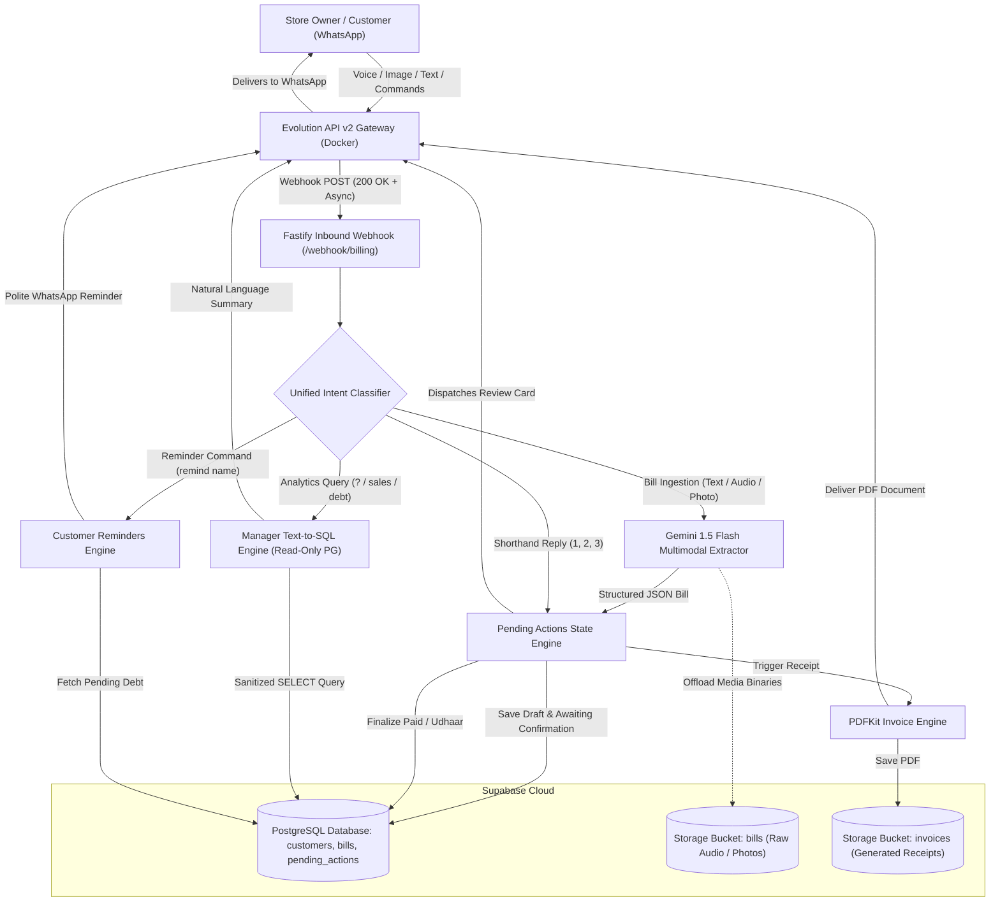

# AI-First WhatsApp Billing & CRM Agent for Kirana & Retail

[](https://www.typescriptlang.org/)
[](https://fastify.dev/)
[](https://supabase.com/)
[](https://ai.google.dev/)
[](https://www.docker.com/)

A self-hosted, multimodal WhatsApp billing platform that turns unstructured Kirana store receipts, voice notes, and vernacular texts into structured accounting, automated PDF invoices, and real-time customer debt tracking.

---

## 🏗️ System Architecture

The agent is engineered around an event-driven, decoupled micro-architecture tailored for the constraints of conversational retail:

- **Event-Driven Webhook Ingestion**: Receives inbound WhatsApp events from an Evolution API v2 gateway via Fastify HTTP endpoints, instantly acknowledging with `200 OK` in <10ms to eliminate Baileys retry loops.
- **Single-Chat Unified Intent Routing**: Processes all interactions inside a single store owner WhatsApp conversation, differentiating between bill drafts, numeric confirmation shorthand (`1`, `2`, `3`), payment reminders, and Text-to-SQL analytics queries via regex and linguistic heuristics without state collisions.
- **Asynchronous Background Offload**: Multimodal Gemini 1.5 Flash extractions, PDFKit invoice compilation, and customer WhatsApp dispatches execute asynchronously in background workers, ensuring immediate interactive feedback to the store owner.
- **Dual-Storage Persistence**: Decouples unstructured media storage from relational transactional data using Supabase Storage buckets (`bills` for raw voice/images, `invoices` for generated PDF receipts) alongside a PostgreSQL database with strict foreign keys and atomic state transitions.



---

## ⚡ Quickstart & Testing Guide

### Prerequisites
- **Node.js**: v20.x or higher
- **Docker & Docker Compose**: For running Evolution API v2 gateway
- **Supabase Project**: With PostgreSQL database and Storage buckets (`bills`, `invoices`)
- **Google Gemini API Key**: For multimodal extraction and Text-to-SQL analytics
- **Active WhatsApp Number**: Connected to the Evolution API instance

---

### Local Installation & Startup

1. **Clone the repository:**
   ```bash
   git clone https://github.com/goutham2222/ai-billing-agent.git
   cd ai-billing-agent
   ```

2. **Install project dependencies:**
   ```bash
   npm install
   ```

3. **Configure Environment Variables:**
   Copy `.env.example` to `.env` and fill in your keys:
   ```bash
   cp .env.example .env
   ```
   Required keys:
   - `GEMINI_API_KEY`: Google Gemini API key
   - `SUPABASE_URL` & `SUPABASE_SERVICE_ROLE_KEY`: Supabase project credentials
   - `DATABASE_URL`: PostgreSQL connection string (with encoded password)
   - `EVOLUTION_API_URL` & `EVOLUTION_API_KEY`: Evolution API endpoint and auth token
   - `EVOLUTION_INSTANCE_NAME`: Name of your configured WhatsApp instance
   - `STORE_OWNER_PHONE`: Normalized E.164 phone number of store owner (e.g. `919550145675`)

4. **Launch WhatsApp Gateway (Docker):**
   ```bash
   docker compose -f infra/docker-compose.yml up -d
   ```
   Open `http://localhost:8080`, pair your WhatsApp instance via QR code, and point the webhook to `https://your-public-url/webhook/billing`.

5. **Start Application in Development Mode:**
   ```bash
   npm run dev
   ```

---

### 🧪 Test Drive Cheat Sheet

Use these exact WhatsApp messages from the authorized `STORE_OWNER_PHONE` to test the agent end-to-end:

| Workflow | Example Message / Action | Expected Result |
| :--- | :--- | :--- |
| **New Customer Bill** | `Ramesh 9876543210 2 kg sugar 90, 1 sunflower oil 160 paid` | Draft created, registers Ramesh as new customer, sends confirmation card with total Rs. 250. |
| **Vernacular Udhaar Bill** | `Suresh 9123456789 5 packets bread 200 udhaar` | Detects `udhaar` debt marker, creates draft awaiting confirmation with total Rs. 200. |
| **Confirm as Paid** | Reply `1` or `paid` | Confirms bill as PAID, updates customer ledger, delivers PDF invoice to customer WhatsApp, sends text receipt summary to owner. |
| **Confirm as Udhaar** | Reply `2` or `udhaar` | Confirms bill as PENDING UDHAAR, updates outstanding debt balance on customer record, delivers PDF invoice. |
| **Discard / Cancel** | Reply `3` or `cancel` | Cancels the active draft, notifies owner that draft has been discarded. |
| **Walk-in Udhaar Guardrail** | Ingest: `2 cold drinks 80`<br>Then reply `2` | System blocks Udhaar credit: *"⚠️ Cannot assign Udhaar to an anonymous Walk-in Customer. Please provide customer name or phone."* Draft remains active. |
| **Manager Analytics (English)**| `? Who owes more than 500 rupees?` | Text-to-SQL engine queries PostgreSQL customer ledger and returns formatted debt breakdown. |
| **Manager Analytics (Vernacular)**| `Aaj ka total sales kitna hai?` | Generates safe `SELECT SUM(total_amount)` query and reports today's total revenue in WhatsApp. |
| **Customer Payment Reminder**| `remind Suresh` | Fetches Suresh's pending bills and total debt, and sends a polite payment reminder to his WhatsApp. |
| **Reset Test Environment** | Run in terminal: `npm run db:clean` | Truncates `pending_actions`, `bills`, `customers`, restarts bill sequence to 1, and empties storage buckets. |

---

## 🎯 Core Capabilities & Feature Deep Dives

### 1. Multimodal Ingestion & Vernacular Extraction
- **Voice Note Billing**: Kirana owners can dictate bills via WhatsApp audio notes (`.ogg`/`.opus`). The audio is uploaded to Supabase Storage and parsed natively by Gemini 1.5 Flash.
- **Paper Receipt OCR**: Takes photos of handwritten receipts or register books and extracts customer names, phone numbers, items, units, unit prices, and totals.
- **Multilingual Vernacular Debt Detection**: Automatically parses payment intent across English, Hindi, and Telugu:
  - **Settled / Cash**: `paid`, `cash`, `gpay`, `phonepe`, `received`, `settled`, `jama`.
  - **Credit / Debt**: `udhaar`, `baki`, `baaki`, `credit`, `pending`, `katha`, `khata`, `ivvali`, `raavali`.

### 2. 3-Tier Customer Ledger CRM
- **Tier 1: Existing Customer**: Matched by phone number (last 10 digits) or name (`ILIKE`). The confirmation card dynamically surfaces their historical unpaid balance:
  ```text
  Customer: Ramesh (Existing — Outstanding Udhaar: Rs. 1,450)
  ```
- **Tier 2: New Customer Onboarded**: Created when customer details (name or phone) are provided for the first time. Inserted with initial debt balance of `0`.
- **Tier 3: Walk-in Customer (Anonymous)**: Assigned strictly when zero customer identifiers are provided.
- **Walk-in Credit Prevention**: Anonymous walk-in bills cannot be confirmed as Udhaar (`2`). The system alerts the store owner and preserves the draft until a name or phone is supplied.

### 3. Atomic State Machine & Single-Action Guardrails
- **Single Active Pending Action**: Only one draft is active per store owner at any given time. If a new bill is ingested before the previous draft is confirmed, the previous draft is marked `superseded`.
- **60-Second Finalization Window**: If an owner replies `1`, `2`, or `3` after a bill has already been confirmed, the system verifies `resolved_at`. If finalized within the last 60 seconds, it alerts:
  ```text
  ⚠️ This bill has already been confirmed and finalized.
  ```
- **Quantity-Prefix Preservation**: Eliminates prefix ambiguities so messages like `"2 cold drinks 80"` extract as bills first rather than being misparsed as shorthand choice `2`.

### 4. Dynamic PDF Invoicing & Automated Reminders
- **Branded PDF Invoices**: Generates clean, formatted receipts using PDFKit featuring Store Name, Date, Bill Number, Itemized Line Table, Total, and visual badges (`PAID / SETTLED` in green, `PENDING UDHAAR` in amber).
- **Zero Owner Document Spam**: When a bill is confirmed, the store owner receives **only** a clean text confirmation message.
- **Customer Delivery**: If the customer has a valid phone number, the PDF document is sent directly to the customer's WhatsApp with a personalized greeting. For placeholder numbers (`newcust-`, `walkin-`), the PDF URL is stored in Supabase Storage silently (`PDF saved to records.`).
- **Customer Payment Reminders**: The owner can type `"remind Raghu"` or `"send reminder to Suresh"` to query their unsettled ledger balance and dispatch a polite reminder message in their preferred language.

### 5. Text-to-SQL Manager Analytics Engine
- **Natural Language Business Intelligence**: Store owners can query sales, inventory, and customer debts using everyday conversational language (e.g. `"? Who owes more than 500 rupees?"`, `"Total sales today?"`, `"Aaj ka hisaab?"`).
- **Strict Read-Only Guardrails**:
  - Only `SELECT` statements are allowed.
  - Queries containing `INSERT`, `UPDATE`, `DELETE`, `DROP`, `ALTER`, `TRUNCATE`, `GRANT`, `REVOKE`, or multi-statement semicolons (`;`) are strictly blocked.
  - Access to PostgreSQL system tables (`pg_*`, `information_schema`) is blocked.
  - Session-level `SET TRANSACTION READ ONLY` with strict 3000ms statement timeout.
  - Output is clamped to 50 rows maximum to prevent token overflows.

---

## 🗄️ Database Schema

### PostgreSQL Schema Architecture (`Supabase`)

```sql
-- 1. Customers Table
CREATE TABLE customers (
    id UUID PRIMARY KEY DEFAULT gen_random_uuid(),
    name TEXT NOT NULL,
    phone TEXT UNIQUE NOT NULL,
    preferred_language TEXT DEFAULT 'en', -- 'en', 'hi', 'te'
    created_at TIMESTAMPTZ DEFAULT NOW()
);

-- 2. Bills Table
CREATE TABLE bills (
    id UUID PRIMARY KEY DEFAULT gen_random_uuid(),
    bill_no SERIAL, -- Auto-incrementing integer bill identifier (e.g. 1, 2, 3...)
    customer_id UUID REFERENCES customers(id) ON DELETE SET NULL,
    total_amount NUMERIC(12, 2) NOT NULL,
    items JSONB DEFAULT '[]', -- [{"name": "Sugar", "quantity": 2, "unit": "kg", "unitPrice": 45, "totalPrice": 90}]
    image_url TEXT,
    pdf_url TEXT,
    payment_status TEXT CHECK (payment_status IN ('paid', 'pending', 'cancelled')) DEFAULT 'pending',
    created_at TIMESTAMPTZ DEFAULT NOW()
);

-- 3. Pending Actions Table (Human-in-the-Loop State Machine)
CREATE TABLE pending_actions (
    whatsapp_message_id TEXT PRIMARY KEY,
    bill_data JSONB, -- Draft bill payload snapshot including customer tier & debt
    owner_phone TEXT,
    status TEXT DEFAULT 'awaiting_confirmation', -- 'awaiting_confirmation', 'completed', 'cancelled', 'superseded'
    created_at TIMESTAMPTZ DEFAULT NOW()
);
```

---

## 📂 Project Structure

```text
ai-billing-agent/
├── docs/                   # System documentation & PRD
│   ├── ARCHITECTURE.md     # Architecture specifications
│   ├── MIGRATION_READONLY.sql # PostgreSQL read-only user creation script
│   ├── PRD.md              # Product requirements document
│   └── SCHEMA.md           # Database schema documentation
├── infra/                  # Docker infrastructure for WhatsApp gateway
│   └── docker-compose.yml  # Evolution API v2, PostgreSQL, & Redis
├── scripts/                # Database maintenance & testing scripts
│   └── clean-slate.ts      # Supabase tables & storage reset utility (npm run db:clean)
├── src/
│   ├── config/             # Zod environment schema validation
│   │   └── env.ts
│   ├── lib/                # Core clients & connection pools
│   │   ├── db-readonly.ts  # Read-only PG pool with timeout & connection URI encoding
│   │   ├── evolution.ts    # Evolution API v2 WhatsApp client (text, media, polls)
│   │   ├── gemini.ts       # Gemini SDK client with exponential backoff & model fallbacks
│   │   └── supabase.ts     # Supabase admin client (Service Role)
│   ├── modules/
│   │   ├── billing/        # Ingestion, Gemini extraction, state engine, & routing
│   │   │   ├── bridge.ts   # Binary media offloader to Supabase Storage
│   │   │   ├── extractor.ts# Multimodal bill parser (text, audio, image)
│   │   │   ├── routes.ts   # Webhook listener, intent classifier, & shorthand router
│   │   │   ├── schemas.ts  # Zod validation schemas for line items & customer info
│   │   │   └── state.ts    # Draft persistence, confirmation logic, & 3-tier CRM
│   │   ├── invoicing/      # PDF receipt generation & customer debt reminders
│   │   │   ├── pdf-generator.ts # Branded PDFKit receipt builder
│   │   │   ├── reminders.ts     # Vernacular payment reminder dispatch
│   │   │   └── storage.ts       # Supabase Storage invoice bucket manager
│   │   ├── manager/        # Manager Text-to-SQL analytics engine
│   │   │   ├── executor.ts # AST/regex SQL guardrails & query execution
│   │   │   ├── routes.ts   # Manager endpoint & authorization
│   │   │   ├── schema-context.ts # Postgres DDL & business intelligence context
│   │   │   └── sql-generator.ts  # Text-to-SQL translation with Gemini
│   │   └── routing/        # Intent classification for single-account dual bots
│   │       └── classifier.ts# Linguistic regex & prefix detection
│   ├── types/
│   │   └── evolution.ts    # Evolution API webhook payload type definitions
│   └── index.ts            # Fastify application bootstrap & server listener
├── DEBUG_LOG.md            # Production incident log & root cause resolutions
├── package.json
└── tsconfig.json
```

---

## 🏆 Milestone Completion Status

| Stage | Milestone Description | Status |
| :---: | :--- | :---: |
| **Stage 1** | **Foundation & Inbound Webhook Pipeline**<br>Fastify server setup, Evolution API v2 webhook receiver, Supabase Storage binary offloading bridge. | ✅ **Complete** |
| **Stage 2** | **Multimodal Gemini Extraction Engine**<br>Multimodal parsing with Gemini 1.5 Flash (`@google/genai`) for text, voice notes (`.ogg`/`.opus`), and receipt images with Zod validation and multilingual vernacular debt detection (`baki`, `udhaar`, `ivvali`). | ✅ **Complete** |
| **Stage 3** | **State Engine & Atomic Confirmation Workflows**<br>Single active draft enforcement (`superseded`), deterministic text shorthand (`1`=Paid, `2`=Udhaar, `3`=Cancel), 3-tier customer CRM (Existing with debt, New Onboarded, Walk-in Anonymous), and Walk-in Udhaar guardrail. | ✅ **Complete** |
| **Stage 4** | **Manager Bot Text-to-SQL Engine**<br>Natural language queries translated to SQL via Gemini, executed over read-only PostgreSQL role, AST/regex guardrails enforcing strict `SELECT` only, zero destructive commands, and execution row/timeout clamps. | ✅ **Complete** |
| **Stage 5** | **Dynamic PDF Invoicing & WhatsApp Reminders**<br>Branded PDF generation using PDFKit, Supabase Storage `invoices` bucket integration, customer WhatsApp delivery with store owner text confirmation, and automated vernacular debt payment reminders. | ✅ **Complete** |

---

## 📜 License

MIT License. Built for modern Kirana and retail store digitization.
