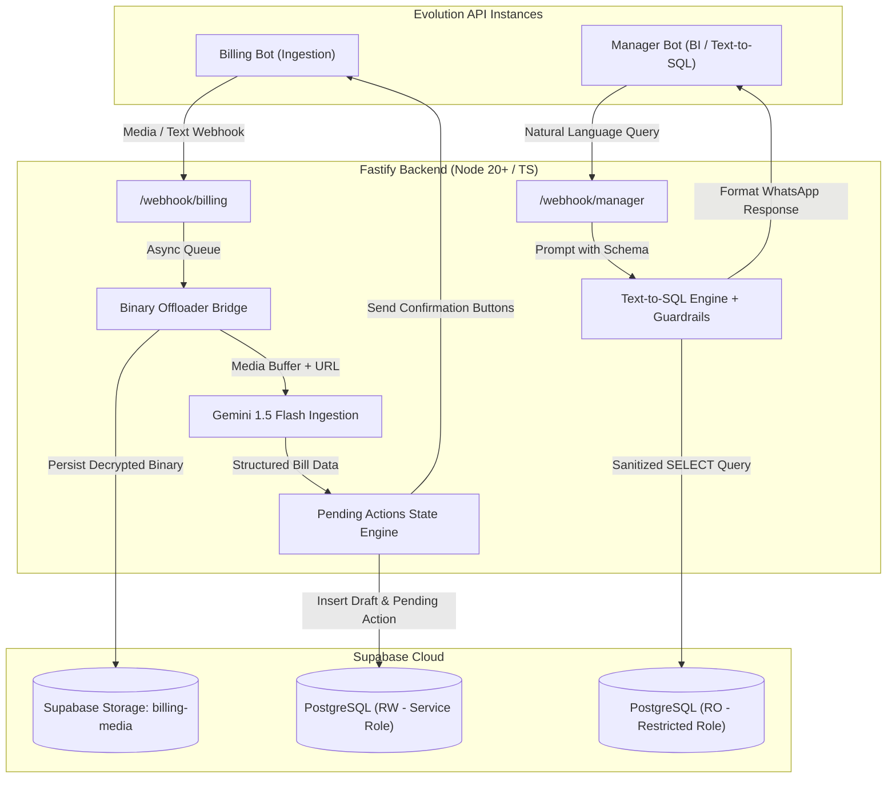

# System Architecture: AI Billing Agent

## High-Level Architecture

The system operates as a decentralized, AI-first WhatsApp Billing and Debt CRM backend designed to process retail ledger operations across dual WhatsApp bot interfaces.

## Core Components

1. **Evolution API Gateway**: Connects directly to WhatsApp web sockets and delivers webhooks for incoming text, audio voice notes, handwritten receipts, and interactive button replies.
2. **Binary Offloading Bridge**: Downloads media binaries immediately before temporary WhatsApp CDN media URLs expire and uploads them to Supabase Storage.
3. **Gemini 1.5 Flash Ingestion**: Multimodal and multilingual (English, Hindi, Telugu) parsing with Zod schema validation and retail debt term normalization (`baki`, `udhaar`, `pending`).
4. **State Engine (`pending_actions`)**: Manages confirmation workflows (`Mark as Paid`, `Confirm Pending`, `Edit / Reject`) without in-memory state.
5. **Manager Bot Text-to-SQL Engine**: Direct read-only database role connection with AST query sanitization, timeouts, and row clamps.
